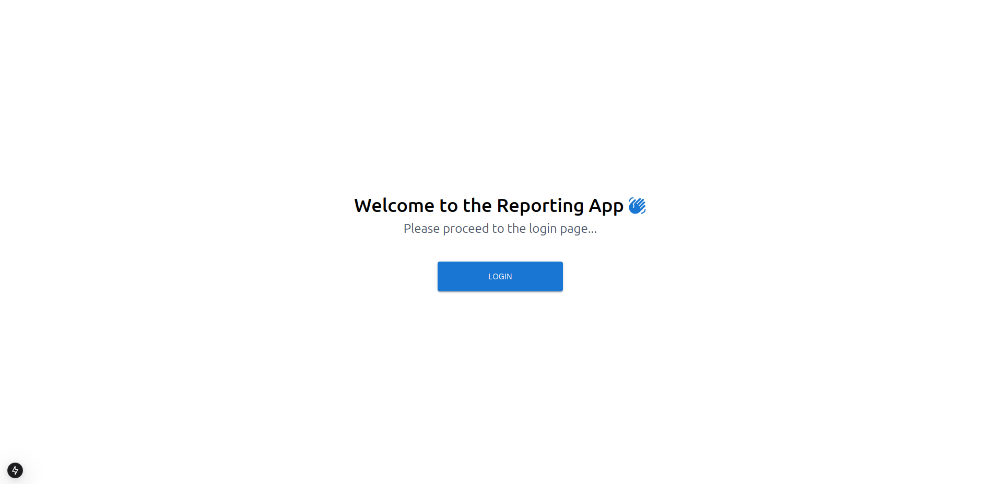
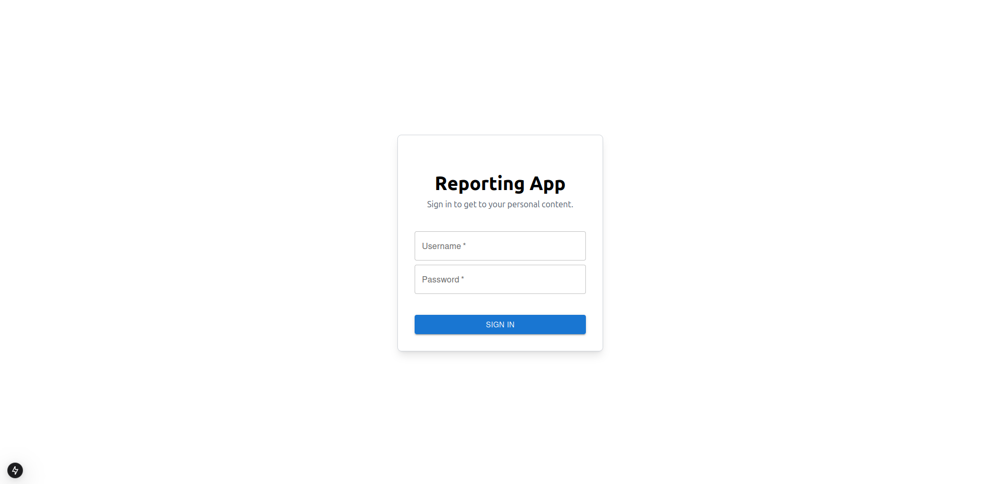
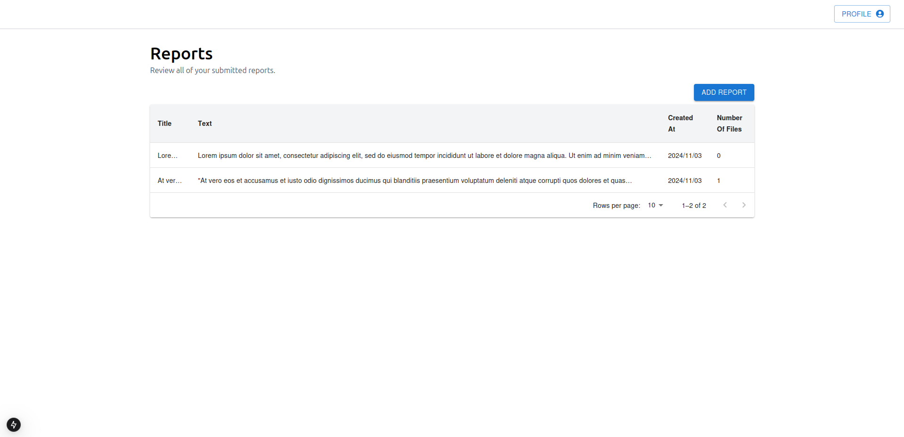
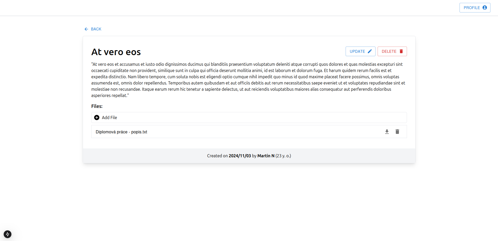
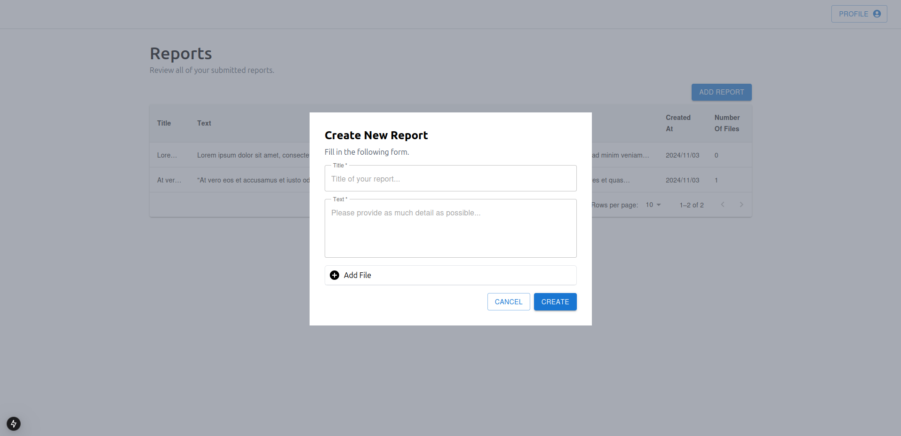

# Reporting App

Hi, welcome to this repository.

## Run the code

The project is divided to a back-end part and a front-end part. You can find them in their own folders. To start up the project, follow up with the instructions below.

To start up the back-end:

```
cd backend
npm install
npm run start
```

To start up the front-end:

```
cd frontend
npm install
npm run dev
```

Open [https://localhost:3000](https://localhost:3000) with your browser to see the result.

## Notes

I generated private keys and certificates and uploaded them to this repository so you wouldn't have to think about it when starting up the project. This is, of course, a bad practise as these secrets should not be publicly available at normal circumstances. You can find them in `backend/secrets` and `frontend/certificates`. If you want to fork this project, please consider removing these secrets and generate new ones.

## Illustrations

#### Main Page



#### Login Page



#### Reports Page



#### Detail Page



#### Form Dialog


